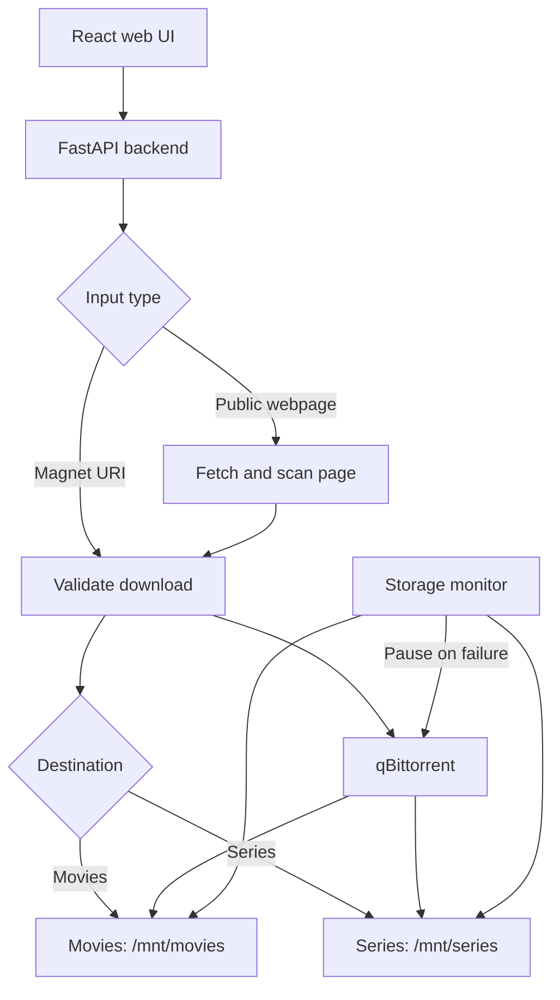

<div align="center">

# ⚡ AutoTor

### Your downloads. Your storage. One clean interface.

**A self-hosted, LAN-only download manager built around qBittorrent.**

Paste a magnet link or a public webpage, choose **Movies** or **Series**, and let AutoTor handle the rest.

[](https://www.docker.com/)
[](https://react.dev/)
[](https://fastapi.tiangolo.com/)
[](https://www.qbittorrent.org/)
[](#security--storage-protection)

[Features](#-features) · [Quick start](#-quick-start) · [How it works](#-how-it-works) · [Safety](#-security--storage-protection) · [Testing](#-testing)

</div>

---

## ✨ Features

| Feature | What it does |
| :--- | :--- |
| 🧲 **Magnet & webpage input** | Accept a magnet URI directly or scan a public webpage for a magnet link. |
| 🎬 **Movies or Series** | Route downloads to the selected media share. |
| 📦 **Bulk downloads** | Filter a listing by an optional episode range, Must Include name, resolution, and extra keyword; add up to 100 matches while skipping duplicates. |
| 🖥️ **Custom web interface** | Manage the workflow through a React UI backed by FastAPI. |
| 💾 **Storage-aware downloads** | Check the destination mount and available capacity before downloads proceed. |
| 📺 **Episode organization** | Move completed single-episode Series torrents into show and season folders while keeping qBittorrent's seeding paths current. |
| 🛑 **Automatic protection** | Pause downloads when a storage failure is detected; require a live check before resuming. |
| 🐳 **Docker deployment** | Run the application alongside the existing qBittorrent service using Docker Compose. |

## 🧭 How it works



AutoTor is a control interface for qBittorrent, not a replacement torrent engine. The backend checks the selected destination and submits downloads to the existing qBittorrent service.

## 🚀 Quick start

### Prerequisites

- Docker and Docker Compose
- An existing qBittorrent setup with Web UI credentials
- Writable CIFS mounts at `/mnt/movies` and `/mnt/series`
- Access to the server on your trusted LAN

### 1. Clone the repository

```bash
git clone https://github.com/martin861101/AutoTor.git
cd AutoTor
```

### 2. Configure the environment

```bash
cp .env.example .env
```

Edit `.env` and enter the **existing** qBittorrent Web UI username and password. Review the remaining settings in `.env.example` for your environment.

> [!IMPORTANT]
> Do not reset or replace your existing qBittorrent configuration. AutoTor is designed to connect to it.

### 3. Check your storage mounts

```bash
findmnt -T /mnt/movies
findmnt -T /mnt/series
```

Both paths must be live, writable CIFS mounts. AutoTor also performs its own write validation before allowing downloads.

### 4. Launch AutoTor

```bash
docker compose up -d --build
```

Open the interface in your browser:

```text
http://<server-lan-address>:9091
```

> [!TIP]
> qBittorrent communicates with AutoTor over the private Compose network. Its host Web UI port defaults to `127.0.0.1:9090`. Only set `QBITTORRENT_BIND_ADDRESS` to a trusted LAN interface if you need direct access to that Web UI.

## 🎯 Download workflow

1. Paste a **magnet URI** or a **public webpage URL**.
2. Choose **Movies** or **Series**.
3. For a listing page, use bulk mode. Optionally enable a same-season episode range and Must Include name, then select resolutions or enter another keyword. Multiple filters apply together; selected resolutions match any of the selected values.
4. AutoTor checks the destination and submits up to 100 matching torrents to qBittorrent. With a range, it selects one release per episode and skips episodes already in the queue, as well as duplicate info hashes or names.
5. The storage monitor continues checking the destination while downloads run.
6. After a single-episode Series torrent completes, the organizer moves it into its show and season folder through qBittorrent.

Webpages that require JavaScript or block automated access may not be scannable. In that case, use a direct magnet URI.

### Episode organizer

The `autotor-organizer` service checks qBittorrent every 60 seconds. When a completed, single-file Series torrent is still at the root of `/mnt/series`, it reads the `S01E07` pattern in the video filename and requests a move through qBittorrent. For example, `Lanterns.2026.S01E07.mkv` moves to `/mnt/series/Lanterns (2026)/Season 01/`. qBittorrent keeps the new path for seeding.

The organizer skips incomplete torrents, files already in subfolders, multi-file packs, non-video files, and names without an episode pattern. It also skips a move if the Series CIFS mount is unavailable or the destination file already exists. Multi-file season packs need manual organization.

To check its activity, run `docker compose logs -f autotor-organizer`. In qBittorrent, enable **Append .!qB extension to incomplete files** so Jellyfin does not scan partial videos at the Series root.

## 🛡️ Security & storage protection

AutoTor is intended for a **trusted local network**, not direct public internet exposure.

| Protection | Behaviour |
| :--- | :--- |
| CIFS verification | Checks that the destination is a live CIFS mount. |
| Write probe | Performs a small create, sync, and delete test. |
| Ongoing monitoring | Pauses downloads after a detected storage failure. |
| Resume validation | Requires a successful live check before resuming. |
| Capacity checks | Accounts for active downloads sharing the same underlying volume. |
| Safe webpage fetching | Restricts requests to public HTTP/HTTPS targets, validates redirects, and rejects local, private, or reserved addresses. |
| Fetch limits | Applies response-size and timeout limits. |

**Shared capacity:** Movies and Series default to a single capacity group, `plex-media`. Keep that grouping when both shares use the same backing Windows volume. Configure distinct volume IDs only when the shares are backed by different volumes.

## 🧪 Testing

Run the backend test suite inside the built API image:

```bash
docker compose run --rm autotor-api pytest -q -p no:cacheprovider
```

Build the frontend image:

```bash
docker compose build autotor-web
```

## 🧰 Technology

| Layer | Technology |
| :--- | :--- |
| Frontend | React |
| Backend | FastAPI |
| Download engine | qBittorrent |
| Deployment | Docker Compose |
| Media storage | CIFS-mounted Movies and Series shares |

## ⚖️ Responsible use

Only download content that you have the right to access and distribute. You are responsible for complying with applicable laws and the terms of any source you use.

---

<div align="center">

**AutoTor** · Self-hosted download management for your own media storage

[Back to top](#-autotor)

</div>
